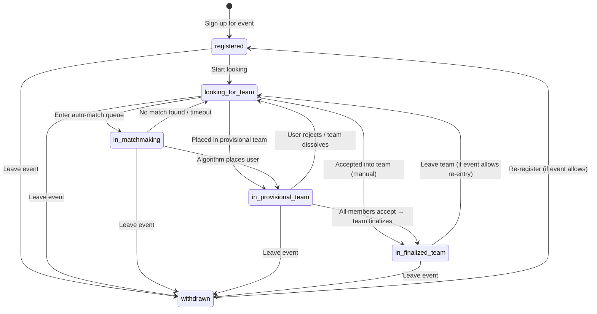
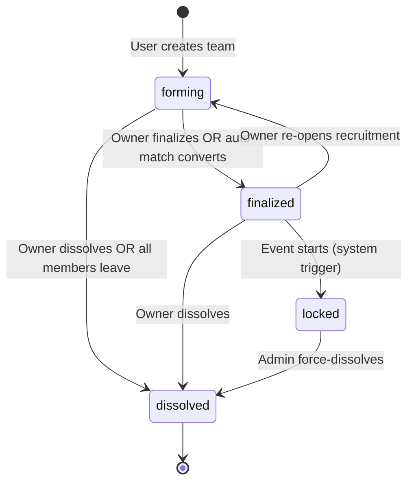
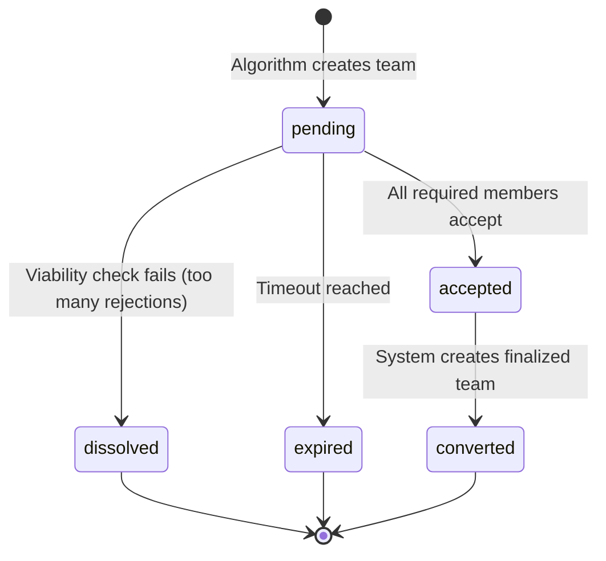
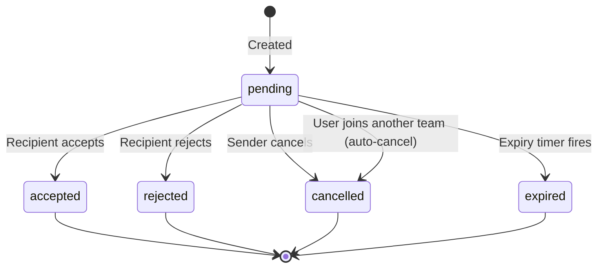

# State Machines — TeamForge

All state transitions are enforced at the **database level** through constraints and application-layer guards. No transition relies solely on frontend logic.

---

## C. User Participation State Machine

Tracks a user's availability **within a specific event**. A user can have different states in different events simultaneously.

### States

| State | Description |
|---|---|
| `registered` | User has signed up for the event but hasn't indicated availability. |
| `looking_for_team` | User is actively available for manual discovery and auto-matchmaking. |
| `in_matchmaking` | User is currently being processed by the auto-match algorithm. Transient state. |
| `in_provisional_team` | User has been placed in a provisional group pending acceptance. |
| `in_finalized_team` | User is a confirmed member of a permanent team. |
| `withdrawn` | User has left the event entirely. |

### State Diagram



### Transition Rules

| From | To | Trigger | Guards |
|---|---|---|---|
| `registered` | `looking_for_team` | User clicks "Start looking" | Event registration is open |
| `registered` | `withdrawn` | User leaves event | — |
| `looking_for_team` | `in_matchmaking` | User opts into auto-match | Matchmaking is enabled for event; restart rate-limit not exceeded |
| `looking_for_team` | `in_provisional_team` | Algorithm places user in provisional team | — |
| `looking_for_team` | `in_finalized_team` | User accepts team invite OR team accepts join request | Team has available slot (atomic check) |
| `looking_for_team` | `withdrawn` | User leaves event | Cancel all pending requests |
| `in_matchmaking` | `in_provisional_team` | Algorithm completes, user assigned | — |
| `in_matchmaking` | `looking_for_team` | No valid team found; algorithm round ends | — |
| `in_matchmaking` | `withdrawn` | User cancels during processing | Remove from matchmaking pool |
| `in_provisional_team` | `in_finalized_team` | All provisional members accept | Atomic transition for all members simultaneously |
| `in_provisional_team` | `looking_for_team` | User rejects; OR provisional team dissolves; OR provisional team expires | Clear provisional_team_id |
| `in_provisional_team` | `withdrawn` | User leaves event | Mark as 'left' in provisional_team_members |
| `in_finalized_team` | `looking_for_team` | User voluntarily leaves team | Team must remain viable (≥ min_size) or the event allows mid-event departures |
| `in_finalized_team` | `withdrawn` | User leaves event | Remove from team_members |
| `withdrawn` | `registered` | User re-registers | Event allows re-registration |

---

## D. Team State Machine

### Finalized Team States

| State | Description |
|---|---|
| `forming` | Team is manually created and actively recruiting members. |
| `finalized` | Team has been finalized by the owner (ready for the event). |
| `locked` | Event has started; no membership changes allowed. |
| `dissolved` | Team has been disbanded. |

### State Diagram



### Transition Rules

| From | To | Trigger | Guards |
|---|---|---|---|
| `[*]` | `forming` | User creates team | User is a participant in the event; user is `looking_for_team` or `registered` |
| `forming` | `finalized` | Owner clicks "Finalize" OR all provisional members accept | `current_members ≥ event.min_team_size` |
| `forming` | `dissolved` | Owner dissolves OR last member leaves | Return all members to `looking_for_team` |
| `finalized` | `forming` | Owner re-opens | `current_members < event.max_team_size` AND event not started |
| `finalized` | `locked` | Event starts | System-triggered; no user action required |
| `finalized` | `dissolved` | Owner dissolves | Return all members to appropriate state |
| `locked` | `dissolved` | Admin/organizer force-dissolves | Emergency action only |

### Provisional Team States

| State | Description |
|---|---|
| `pending` | Created by algorithm; awaiting member responses. |
| `accepted` | All required members have accepted. Ready for conversion. |
| `dissolved` | Not enough members accepted; team cannot continue. |
| `expired` | Timed out before reaching consensus. |
| `converted` | Successfully became a finalized team. |

### Provisional Team State Diagram



### Provisional Team Transition Rules

| From | To | Trigger | Guards |
|---|---|---|---|
| `[*]` | `pending` | Matching algorithm completes | — |
| `pending` | `accepted` | A member accepts AND all members now accepted | — |
| `pending` | `pending` (internal) | A member rejects → system searches for replacement | Replacement found in available pool |
| `pending` | `dissolved` | A member rejects AND no replacement found AND remaining < min_size | Return remaining to `looking_for_team` |
| `pending` | `expired` | `expires_at` reached | Return all pending/accepted members to `looking_for_team` |
| `accepted` | `converted` | System creates finalized team + members | Atomic creation of team + team_members rows |

### Member Replacement Flow

```
Member rejects provisional team
    │
    ├── remaining_accepted + remaining_pending ≥ min_team_size?
    │   ├── YES → Search available pool for replacement
    │   │         ├── Replacement found → Add to provisional team (status: pending)
    │   │         └── No replacement → Is team still ≥ min_size without replacement?
    │   │                               ├── YES → Continue with smaller team
    │   │                               └── NO  → Dissolve provisional team
    │   └── NO  → Dissolve provisional team
```

---

## E. Request / Invitation State Machine

Three distinct interaction types share the same state model but differ in semantics:

| Type | Direction | Description |
|---|---|---|
| `join_request` | User → Team | User asks to join an existing team. |
| `team_invite` | Team → User | Team (owner/admin) invites a user. |
| `personal_invite` | User → User | User invites a known person to their team. |

### States

| State | Description |
|---|---|
| `pending` | Request/invitation has been sent, awaiting response. |
| `accepted` | Recipient approved the request. |
| `rejected` | Recipient declined the request. |
| `cancelled` | Sender withdrew the request before a response. |
| `expired` | No response within the expiry window. |

### State Diagram



### Transition Rules

| From | To | Trigger | Guards |
|---|---|---|---|
| `[*]` | `pending` | Sender creates request | No duplicate pending request exists (enforced by unique partial index); sender is not blocked by recipient; team has open slots (for join_request); recipient is `looking_for_team` (for invites) |
| `pending` | `accepted` | Recipient acts | **Atomic:** Recipient still in valid state; team still has slot; all concurrent pending requests for this user are auto-cancelled |
| `pending` | `rejected` | Recipient acts | — |
| `pending` | `cancelled` | Sender acts OR system auto-cancels | Auto-cancel on: user joins another team, user leaves event, team dissolves, team fills up |
| `pending` | `expired` | Scheduled job or lazy check | `NOW() > expires_at` |

### Side Effects on Acceptance

```
join_request accepted:
    → Add user to team_members
    → Update event_participants status → 'in_finalized_team'
    → Cancel all other pending requests/invitations for this user in this event
    → Send notification to user
    → Send notification to team members

team_invite accepted:
    → Add user to team_members
    → Update event_participants status → 'in_finalized_team'
    → Cancel all other pending requests/invitations for this user in this event
    → Send notification to team

personal_invite accepted:
    → Add invited user to sender's team
    → Update event_participants status → 'in_finalized_team'
    → Cancel all other pending requests/invitations for invited user in this event
    → Send notification to sender
```

### Auto-Cancellation Triggers

The system automatically cancels pending requests/invitations when their preconditions become invalid:

| Trigger | What gets cancelled |
|---|---|
| User joins a team | All pending `join_request`, `team_invite`, `personal_invite` where user is sender or recipient |
| Team fills up | All pending `join_request` for that team; all pending `team_invite` from that team |
| Team dissolves | All pending `join_request` for that team; all pending `team_invite` from that team |
| User leaves event | All pending requests involving that user |
| User blocks another user | All pending requests between the two users |

---

## State Machine Invariants

These invariants must hold at all times. Violation indicates a bug:

1. **Single-team rule:** A user in `in_finalized_team` state has exactly one active `team_members` row (where `left_at IS NULL`) within that event.
2. **Single-provisional rule:** A user in `in_provisional_team` state has exactly one active `provisional_team_members` row (where `status IN ('pending', 'accepted')`) within that event.
3. **No orphans:** A user whose team dissolves is always returned to `looking_for_team` (or `withdrawn` if they chose to leave).
4. **No phantom slots:** `team_members` count (where `left_at IS NULL`) never exceeds `teams.max_size`.
5. **Consistent participant state:** `event_participants.team_id` is non-NULL if and only if `status = 'in_finalized_team'`.
6. **Consistent provisional state:** `event_participants.provisional_team_id` is non-NULL if and only if `status = 'in_provisional_team'`.
7. **No pending after resolution:** Once a request transitions out of `pending`, it never transitions back.
